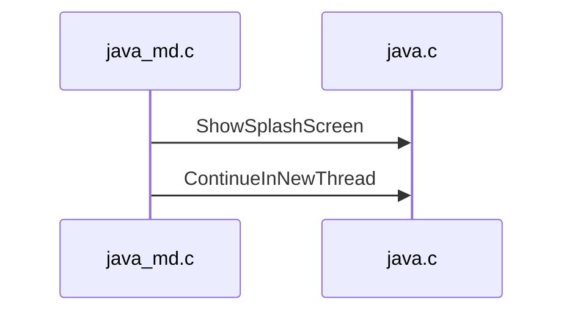
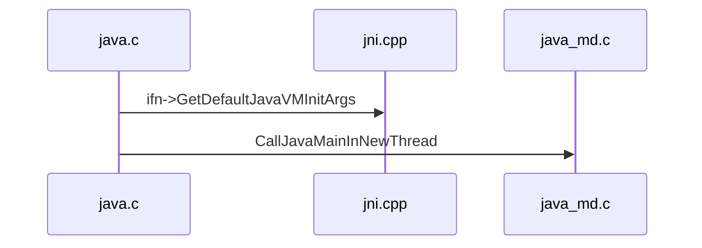

[`main.c#main`](main.c)

```c
/**
 * main 函数主要是为 JLI_Launch 函数解析设置参数
 */
JNIEXPORT int
main(int argc, char **argv)
{
    int margc;
    char** margv;
    int jargc = argc;
    char** jargv = argv;
    const jboolean const_javaw = JNI_FALSE;

    return JLI_Launch(margc, margv,
                jargc, (const char**) jargv,
                0, NULL,
                VERSION_STRING,
                DOT_VERSION,
                (const_progname != NULL) ? const_progname : *margv,
                (const_launcher != NULL) ? const_launcher : *margv,
                jargc > 0,
                const_cpwildcard, const_javaw, 0);
}
```

[`java.c#JLI_Launch`](../libjli/java.c)

```c
JNIEXPORT int JNICALL
JLI_Launch(int argc, char ** argv,              /* main argc, argv */
        int jargc, const char** jargv,          /* java args */
        int appclassc, const char** appclassv,  /* app classpath */
        const char* fullversion,                /* full version defined */
        const char* dotversion,                 /* UNUSED dot version defined */
        const char* pname,                      /* program name */
        const char* lname,                      /* launcher name */
        jboolean javaargs,                      /* JAVA_ARGS */
        jboolean cpwildcard,                    /* classpath wildcard*/
        jboolean javaw,                         /* windows-only javaw */
        jint ergo                               /* unused */
)
{
    int mode = LM_UNKNOWN;
    // classpath
    char *what = NULL;
    // 有 main 方法的 class 文件
    char *main_class = NULL;
    int ret;
    InvocationFunctions ifn;
    // 启动时间
    jlong start = 0, end = 0;
    // JVM 的路径
    char jvmpath[MAXPATHLEN];
    // JRE 的路径
    char jrepath[MAXPATHLEN];

    /*
     * SelectVersion() has several responsibilities:
     * SelectVersion() 有几个职责:
     *
     *  1) Disallow specification of another JRE.  With 1.9, another
     *     version of the JRE cannot be invoked.
     *  1) 禁止指定其他 JRE。1.9 是另一个无法调用 JRE 版本。
     * 
     *  2) Allow for a JRE version to invoke JDK 1.9 or later.  Since
     *     all mJRE directives have been stripped from the request but
     *     the pre 1.9 JRE [ 1.6 thru 1.8 ], it is as if 1.9+ has been
     *     invoked from the command line.
     *  2) 允许 JRE 版本调用 JDK 1.9 或更高版本。
     *     自所有 mJRE 指令都已从请求中剥离，但是 1.9 之前的 JRE[1.6 到 1.8]，就像 1.9+ 一样从命令行调用。
     * 
     * 其他，从 jar 包中读取 META-INF/MAINFEST.MF 获取 main_class
     */
    SelectVersion(argc, argv, &main_class);

    // 创建 JVM 执行环境，确定数据模型，如 32/64 位 jvm
    CreateExecutionEnvironment(&argc, &argv,
                               jrepath, sizeof(jrepath),
                               jvmpath, sizeof(jvmpath),
                               jvmcfg,  sizeof(jvmcfg));

    ifn.CreateJavaVM = 0;
    ifn.GetDefaultJavaVMInitArgs = 0;

    // 加载 libjvm 动态链接库, 加载函数 
    // `JNI_CreateJavaVM`、
    // `JNI_GetDefaultJavaVMInitArgs`、
    // `JNI_GetCreatedJavaVMs`
    // 并绑定 `InvocationFunctions *ifn`
    if (!LoadJavaVM(jvmpath, &ifn)) {
        return(6);
    }

    ++argv;
    --argc;

    /* Parse command line options; if the return value of
     * ParseArguments is false, the program should exit.
     * 解析命令行参数；若参数如 '--help' 之类的则返回 true 退出程序
     */
    if (!ParseArguments(&argc, &argv, &mode, &what, &ret, jrepath)) {
        return(ret);
    }

    /* Override class path if -jar flag was specified */
    if (mode == LM_JAR) {
        SetClassPath(what);     /* Override class path */
    }

    // JVM 初始化后启动
    return JVMInit(&ifn, threadStackSize, argc, argv, mode, what, ret);
}
```


[`java_md.c#JVMInit`](../../../unix/native/libjli/java_md.c)

1. [ShowSplashScreen](../libjli/java.c) Swing/AWT 相关
2. [ContinueInNewThread](../libjli/java.c) 初始化线程栈, 然后使用新线程执行 Java 的 `public static void main(String[])` 方法



[`java.c#ContinueInNewThread`](../libjli/java.c)

1. [ifn->GetDefaultJavaVMInitArgs](../../../../hotspot/share/prims/jni.cpp) 设置栈大小, 1.1 版本后不支持, 忽略
2. [CallJavaMainInNewThread](../../../unix/native/libjli/java_md.c) 阻塞当前线程创建新线程, 在新线程调用 `main` 静态方法



[`java_md.c#CallJavaMainInNewThread`](../../../unix/native/libjli/java_md.c)

1. `pthread_attr_setguardsize(&attr, 0)` 获得线程栈末尾的警戒缓冲区大小
2. `pthread_create(&tid, &attr, ThreadJavaMain, args)` 创建新线程, 执行 `ThreadJavaMain` 逻辑
    1. `ThreadJavaMain` -> `JavaMain`
    2. `JavaMain` -> `InvocationFunctions ifn = args->ifn;`
    3. `JavaMain` -> `InitializeJVM` 初始化 JVM
        1. `InitializeJVM` -> [`ifn->CreateJavaVM(pvm, (void **)penv, &args);`](../../../../hotspot/share/prims/readme.md) 创建 JVM
    4. `JavaMain` -> `LoadMainClass` 加载 main 类
    5. `JavaMain` -> `(*env)->GetStaticMethodID(env, mainClass, "main", "([Ljava/lang/String;)V");` 获取 main 方法
    6. `JavaMain` -> `(*env)->CallStaticVoidMethod(env, mainClass, mainID);` 执行 main 方法
3. `pthread_join(tid, &tmp)` 当前线程等待新线程完成

此处, JVM 就完成初始化并执行 Java 的 `public static void main(String[])` 方法。
