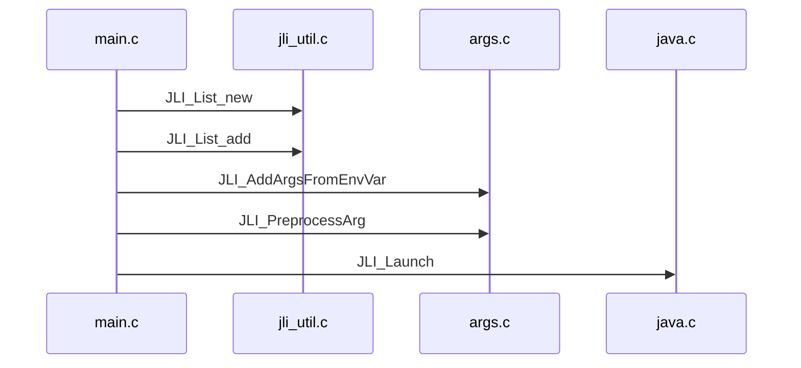
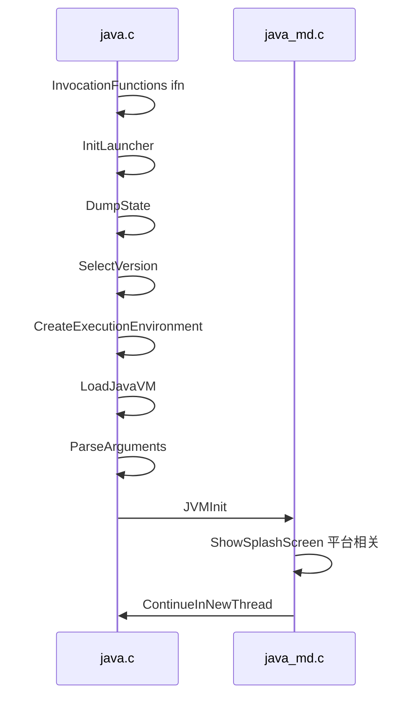

[`main.c`](main.c)

1. 执行 [JLI_List_new](../libjli/jli_util.c) 创建 [JLI_List args](../libjli/jli_util.h) 结构体保存命令行参数
2. [JLI_List_add](../libjli/jli_util.c)添加 C 参数到 Java 参数列表
3. [JLI_AddArgsFromEnvVar](../libjli/args.c) 从环境变量 [`JDK_JAVA_OPTIONS`](../libjli/java.h) 获取 java 参数
4. [JLI_PreprocessArg](../libjli/args.c) 解析 C 参数, 若参数以 `@` 开头, 则保存到临时列表 `JLI_List argsInFile` 后遍历保存到 `args`; 否则直接添加到 `args`
5. [`JLI_Launch`](../libjli/java.c) 启动 JVM

JLI_Launch:
1. InitLauncher
2. DumpState
3. SelectVersion
4. CreateExecutionEnvironment
5. LoadJavaVM
6. ParseArguments
7. JVMInit
8. ShowSplashScreen
9. ContinueInNewThread

ContinueInNewThread:
1. GetDefaultJavaVMInitArgs 设置栈大小
2. CallJavaMainInNewThread 在新线程调用 `main` 静态方法
