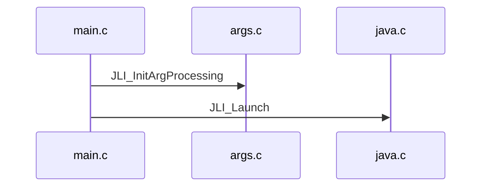
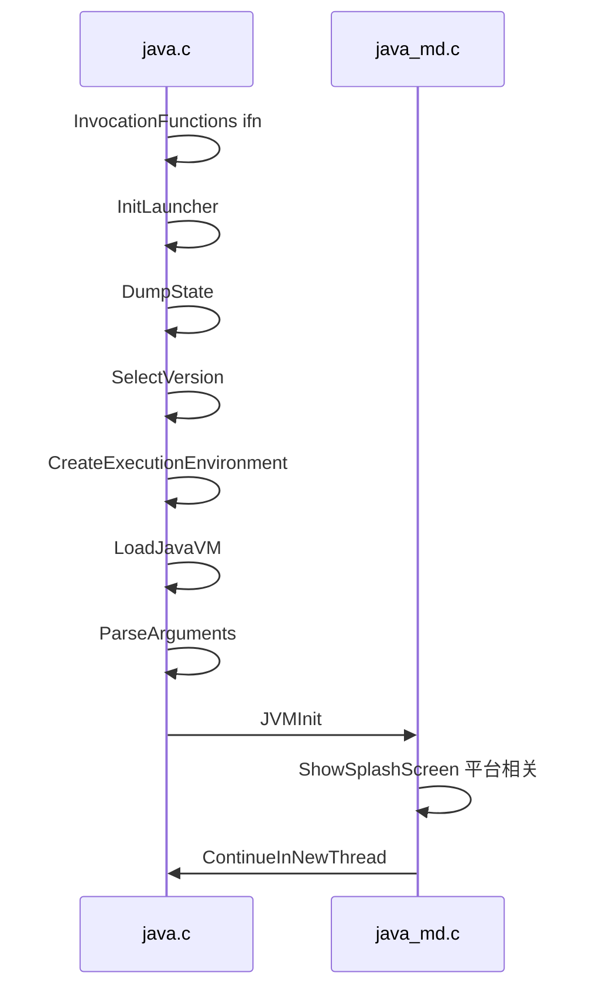

`java Main` 最开始的代码即从 [`main.c`](main.c) 代码开始, \
将传参保存到 [JLI_List_](../libjli/jli_util.h) 结构体里, \
然后执行真正的启动函数 [JLI_Launch](main.c)

JLI_Launch:
1. InitLauncher
2. DumpState
3. SelectVersion
4. CreateExecutionEnvironment
5. LoadJavaVM
6. ParseArguments
7. JVMInit
8. ShowSplashScreen
9. ContinueInNewThread

ContinueInNewThread:
1. GetDefaultJavaVMInitArgs 设置栈大小
2. CallJavaMainInNewThread 在新线程调用 `main` 静态方法
