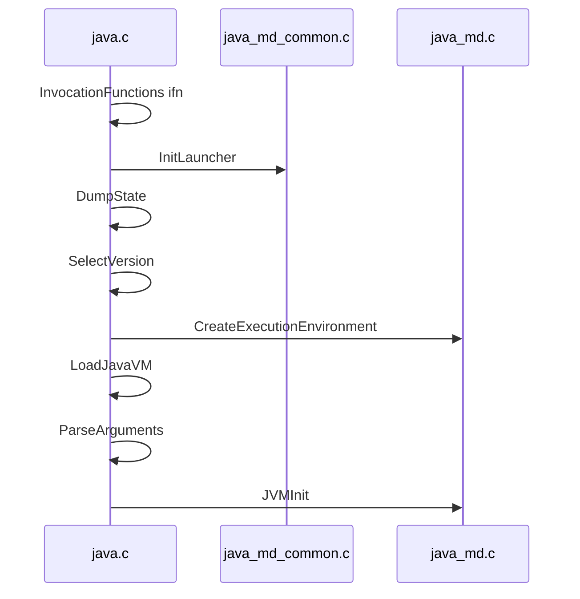
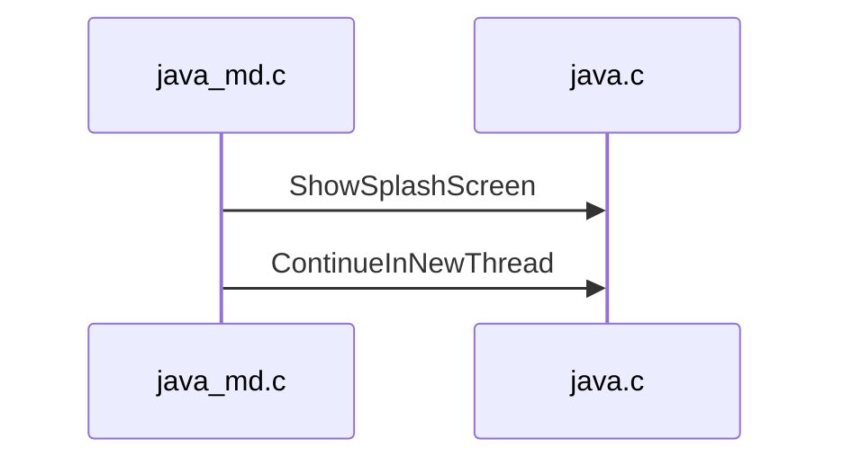
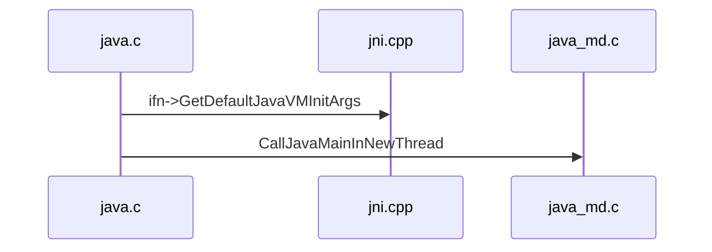

[`main.c#main`](main.c)

```c
/**
 * main 函数主要是为 JLI_Launch 函数解析设置参数
 */
JNIEXPORT int
main(int argc, char **argv)
{
    int margc;
    char** margv;
    int jargc = argc;
    char** jargv = argv;
    const jboolean const_javaw = JNI_FALSE;

    return JLI_Launch(margc, margv,
                jargc, (const char**) jargv,
                0, NULL,
                VERSION_STRING,
                DOT_VERSION,
                (const_progname != NULL) ? const_progname : *margv,
                (const_launcher != NULL) ? const_launcher : *margv,
                jargc > 0,
                const_cpwildcard, const_javaw, 0);
}
```

[`java.c#JLI_Launch`](../libjli/java.c)

1. [InitLauncher](../../../unix/native/libjli/java_md_common.c) 初始化启动器
2. [DumpState](../libjli/java.c) 根据初始化判断是否打印信息
3. [SelectVersion](../libjli/java.c) 确保有合适的 JRE 运行
4. [CreateExecutionEnvironment](../../../unix/native/libjli/java_md.c) 创建执行环境
5. [LoadJavaVM](../../../unix/native/libjli/java_md.c) 加载 libjvm 动态链接库, 加载函数 `JNI_CreateJavaVM`、`JNI_GetDefaultJavaVMInitArgs`、`JNI_GetCreatedJavaVMs`并绑定 `InvocationFunctions *ifn`
6. [ParseArguments](../libjli/java.c) 解析命令行参数
7. [JVMInit](../libjli/java.c) JVM 初始化



[`java_md.c#JVMInit`](../../../unix/native/libjli/java_md.c)

1. [ShowSplashScreen](../libjli/java.c) Swing/AWT 相关
2. [ContinueInNewThread](../libjli/java.c) 初始化线程栈, 然后使用新线程执行 Java 的 `public static void main(String[])` 方法



[`java.c#ContinueInNewThread`](../libjli/java.c)

1. [ifn->GetDefaultJavaVMInitArgs](../../../../hotspot/share/prims/jni.cpp) 设置栈大小, 1.1 版本后不支持, 忽略
2. [CallJavaMainInNewThread](../../../unix/native/libjli/java_md.c) 阻塞当前线程创建新线程, 在新线程调用 `main` 静态方法



[`java_md.c#CallJavaMainInNewThread`](../../../unix/native/libjli/java_md.c)

1. `pthread_attr_setguardsize(&attr, 0)` 获得线程栈末尾的警戒缓冲区大小
2. `pthread_create(&tid, &attr, ThreadJavaMain, args)` 创建新线程, 执行 `ThreadJavaMain` 逻辑
    1. `ThreadJavaMain` -> `JavaMain`
    2. `JavaMain` -> `InvocationFunctions ifn = args->ifn;`
    3. `JavaMain` -> `InitializeJVM` 初始化 JVM
        1. `InitializeJVM` -> [`ifn->CreateJavaVM(pvm, (void **)penv, &args);`](../../../../hotspot/share/prims/readme.md) 创建 JVM
    4. `JavaMain` -> `LoadMainClass` 加载 main 类
    5. `JavaMain` -> `(*env)->GetStaticMethodID(env, mainClass, "main", "([Ljava/lang/String;)V");` 获取 main 方法
    6. `JavaMain` -> `(*env)->CallStaticVoidMethod(env, mainClass, mainID);` 执行 main 方法
3. `pthread_join(tid, &tmp)` 当前线程等待新线程完成

此处, JVM 就完成初始化并执行 Java 的 `public static void main(String[])` 方法。
